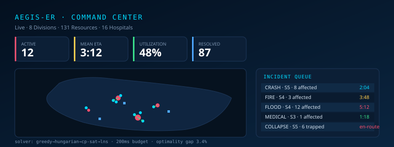
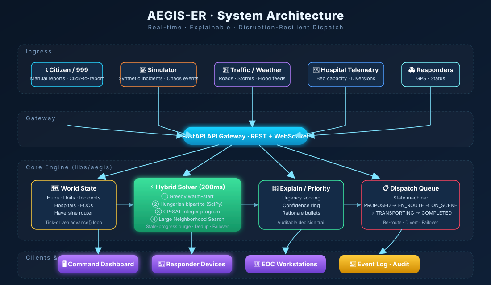

<div align="center">

# AEGIS-ER

**Adaptive Emergency Geospatial Intelligent System — Emergency Response**

*Real-time intelligent dispatch, explainable triage, and disruption-resilient routing for nationwide emergency response.*

[](https://python.org)
[](https://fastapi.tiangolo.com)
[](https://leafletjs.com)
[](LICENSE)
[]()

---



</div>

## Overview

AEGIS-ER is a real-time, explainable emergency-response platform built for high-stakes disaster scenarios. It continuously ingests emergency reports, tracks the live state of every ground and air resource — ambulances, paramedic teams, fire trucks, rescue teams, helicopters, hospitals, and emergency operations centres — and produces near-optimal, conflict-free dispatches within a bounded decision budget, re-optimizing every time the operating environment changes.

The platform ships with a dark-mission-control web dashboard (Leaflet + WebSocket) offering live vehicle tracking, animated routes, an AI/explainability panel, injectable chaos events for resilience testing, one-click manual reporting, and a 55-second guided walkthrough for demo and onboarding.

## Key Features

- 🧠 **Hybrid anytime solver** — greedy warm-start → Hungarian optimal bipartite → CP-SAT → Large Neighborhood Search; always returns a feasible plan within **200 ms** and keeps improving.
- 🗺️ **Live geospatial command center** — dark-mode Leaflet map, WebSocket-streamed state, animated vehicle movement, sparkline KPIs, smart clustering.
- 💡 **Explainable by default** — every dispatch carries a confidence ring, ranked candidates, rejected-resource reasons, and plain-English rationale operators can audit at a glance.
- ⚠️ **Disruption-resilient routing** — automatically re-routes around closed roads, re-plans under storms, diverts patients when a hospital reaches capacity, and fails over to backup units when a responder goes offline — zero operator intervention required.
- 🔀 **Conflict-free dispatch** — stale-progress garbage collection, dedup, and state-machine enforcement guarantee two incidents never claim the same unit and the resolved counter never bounces.
- 🧯 **Chaos-testable** — four one-click chaos injectors (road-closed / storm / hospital-full / unit-fail) make resilience demos reproducible.
- 🧰 **Calm UX** — batched toasts (max 4 concurrent), severity-only auto-notifications, layer toggles, severity/type filters, persistent popups — operators see signal, not spam.
- ⚙️ **Production-ready core** — FastAPI + uvicorn, WebSocket push with 2 s polling fallback, cold-start seeding, health resync, and graceful state resets.

## Tech Stack

| Layer           | Technologies |
|-----------------|--------------|
| Language        | Python 3.10+ |
| Backend API     | FastAPI, Pydantic, uvicorn |
| Solver          | NumPy, SciPy (Hungarian), OR-Tools CP-SAT, custom LNS |
| Geo / Routing   | Haversine, great-circle interpolation, seeded jittered polylines |
| Frontend        | Vanilla JS, Leaflet, HTML5 Canvas, CSS3 (no framework) |
| Transport       | HTTP REST + WebSocket (JSON) |
| Simulation      | Built-in tick-driven simulator (configurable TICK_MS / SIM_SPEED / REOPTIMIZE_MS) |
| Deployment      | Pure Python — `make run` / `python app.py` (no Docker required) |

## Quick Start (Local Python)

```bash
# 1. Clone
git clone https://github.com/meherabmehu/aegis-er-platform.git
cd aegis-er-platform

# 2. Install dependencies (Python 3.10+)
pip install -e libs/aegis
pip install -r requirements.txt

# 3. Run
make run
```

On Windows, double-click `start.bat` — it activates the venv, sets `PYTHONPATH`, and launches the API + dashboard. On PowerShell:

```powershell
.\.venv\Scripts\Activate.ps1
$env:PYTHONPATH="libs/aegis"
$env:AEGIS_DASHBOARD_DIR="services/dashboard"
python services\assignment-solver\app.py
```

Then open:

| URL | Purpose |
|-----|---------|
| http://localhost:8000 | Command-center dashboard |
| http://localhost:8000/api/health | API health |
| http://localhost:8000/api/state | Full world state (JSON) |

Click **▶ Start Disaster** to begin live simulation, click anywhere on the map to drop a manual incident, or hit **DEMO MODE** for a 55-second guided walkthrough of every feature.

## Project Structure

```
aegis-er-platform/
├── libs/aegis/                # Core engine (pure Python)
│   ├── aegis/
│   │   ├── types.py           # Domain types (Severity, Resource, Incident, Dispatch)
│   │   ├── world.py           # World state, advance(), dispatch lifecycle
│   │   ├── solver.py          # 4-phase hybrid assignment solver
│   │   ├── routing.py         # Haversine router, jittered polylines
│   │   ├── geo.py             # Geo helpers (distance, bearing, offset, nearest-k)
│   │   ├── priority.py        # Urgency scoring
│   │   └── explain.py         # Rationale + confidence generation
│   └── tests/                 # Unit tests
├── services/
│   ├── assignment-solver/
│   │   └── app.py             # FastAPI service (REST + WebSocket + simulator loop)
│   └── dashboard/
│       ├── index.html         # Dashboard markup
│       ├── style.css          # Mission-control dark theme
│       ├── app.js             # Map, KPIs, XAI, demo mode, chaos, WS client
│       └── config.js          # Client config
├── docs/
│   ├── ARCHITECTURE.md        # System architecture deep-dive
│   ├── img/                   # Diagrams & screenshots
│   └── adr/                   # Architecture Decision Records
├── scripts/                   # Maintenance scripts
├── migrations/                # Reserved for future event-log migrations
├── Makefile                   # install / run / test / lint
├── start.bat / run.ps1 / run.sh   # OS launchers
├── CONTRIBUTING.md
└── LICENSE (MIT)
```

## Architecture

<div align="center">
  
</div>

See [`docs/ARCHITECTURE.md`](docs/ARCHITECTURE.md) for the full architectural deep-dive, including solver phases, event flow, and resilience guarantees.

## Disruption Handling (one-click chaos)

| Event | Visual Cue | System Behaviour |
|-------|-----------|------------------|
| **Road closed** | Orange `↪ DETOUR` badge, bent polyline | All active dispatches re-routed instantly |
| **Storm** | Purple `☇ STORM` badge, full-map banner | 40% mobility penalty, ETAs recalculated |
| **Hospital full** | Red `⛝ DIVERTED` badge, pulsing hospital pin | Transporting units diverted to next available bed |
| **Unit failure** | Yellow `✖ FAILOVER` badge | Backup unit dispatched with zero downtime |

Combinations (e.g. road-closed + storm) render dual badges and stacked penalties.

## API Surface

| Method | Endpoint | Purpose |
|--------|----------|---------|
| GET | `/api/health` | Liveness + simulator status |
| GET | `/api/state` | Full world snapshot (incidents, resources, dispatches, hospitals) |
| GET | `/api/incidents` | Active incident list |
| POST | `/api/incidents` | Manual incident report |
| POST | `/api/env-event` | Inject chaos / weather change |
| POST | `/api/actions` | `plan`, `tick`, `sim_start`, `sim_stop`, `reset` |
| WS | `/ws` | Real-time snapshot push (~4 Hz) |

## Running Tests

```bash
make test
# or
pytest libs/aegis/tests
```

## Configuration

All tuning lives as constants at the top of `services/assignment-solver/app.py` and `libs/aegis/aegis/world.py`:

| Constant | Default | Meaning |
|----------|---------|---------|
| `TICK_MS` | 250 | Wall-clock ms per simulation tick |
| `SIM_SPEED` | 120 | Sim-seconds per wall-second |
| `REOPTIMIZE_MS` | 500 | Replan cadence while running |
| `SOLVER_BUDGET_MS` | 200 | Hard bound for solver wall time |
| `SCENARIO` | `bangladesh` | Hub/hospital layout preset |

## Roadmap

- [ ] PostGIS persistence for event log and replay
- [ ] Kafka transport for geo-distributed regional EOCs
- [ ] Redlock-based distributed locking for multi-node deployments
- [ ] Mobile responder app (companion)
- [ ] Bengali-language dashboard toggle
- [ ] Multi-incident bulk triage during mass-casualty events

## Contributing

See [`CONTRIBUTING.md`](CONTRIBUTING.md). Pull requests, architecture-decision records, and bug reports are welcome.

## License

Released under the [MIT License](LICENSE).

---

<div align="center"><sub>Built for high-stakes response. Every second is a life.</sub></div>
